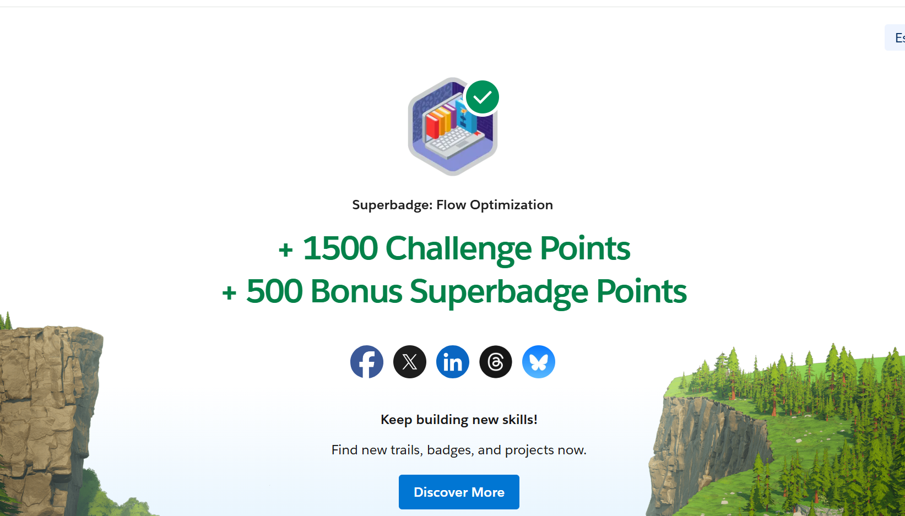
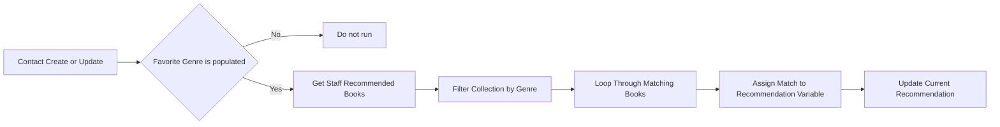
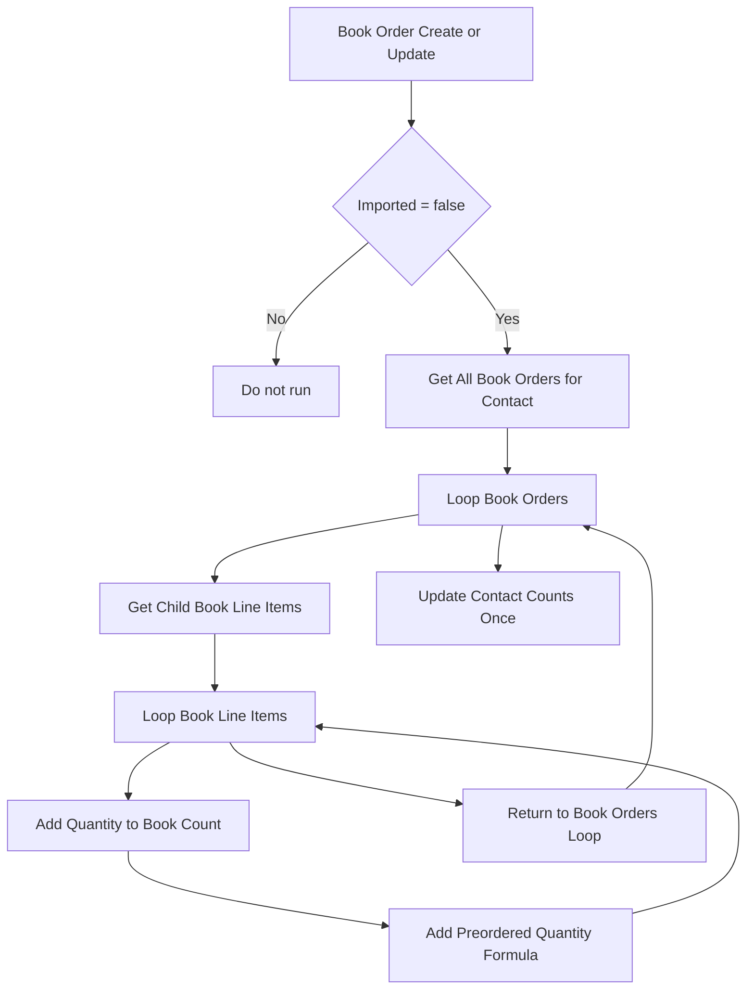
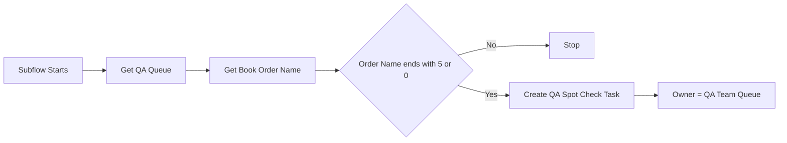

# Superbadge Flow Optimization

[](https://github.com/stampini81/superbadge-flow-optimization/actions/workflows/ci.yml)
[](LICENSE)
[](https://trailhead.salesforce.com/)

Salesforce DX project used to complete the **Flow Optimization** superbadge with a clean, deployable, and documented metadata baseline.

<p align="center">
  
  
  
</p>

<p align="center">
  
</p>

## Author

**Leandro da Silva Stampini**

## Overview

This repository captures the metadata and documentation for the Trailhead superbadge **Flow Optimization**. The goal of the challenge is to improve existing flows so they scale better, reduce unnecessary automation, and create a smoother user experience.

The project focuses on three flows:

- `Staff_Recommendation`
- `Book_Order_Count_1` (`Book Order Count`)
- `Create_QA_Task_for_Book_Order`

## What Was Implemented

### 1. Staff Recommendation

This flow updates the contact's current recommendation based on the reader's favorite genre.

Changes applied:

- Replaced the `Decision` element with a `Collection Filter`.
- Prevented the flow from running when `Favorite_Genre__c` is blank.
- Activated the updated flow version.



### 2. Book Order Count

This flow recalculates the all-time total of ordered books and preordered books for a contact.

Changes applied:

- Moved bulk-import control from a `Decision` to the flow start criteria using `Imported__c = false`.
- Added preorder counting with:

```text
IF({!BookLineItems.Preordered__c},{!BookLineItems.Quantity__c},0)
```

- Updated both:
  - `Contact.Book_Count__c`
  - `Contact.Preordered_Book_Count__c`
- Adjusted the loop path so the contact update happens once after the outer loop finishes.
- Activated the updated flow version.



### 3. Create QA Task for Book Order

This subflow creates QA review tasks for selected orders.

Changes applied:

- Assigned created tasks to the `QA_Team` queue instead of the running user.
- Expanded the condition so tasks are created for every order ending in `5` or `0`.
- Kept the flow active and deployable.



## Project Structure

```text
.
|-- .github/
|   `-- workflows/
|       `-- ci.yml
|-- docs/
|   `-- imagens/
|-- force-app/
|   `-- main/default/
|       |-- flows/
|       `-- objects/
|-- manifest/
|   `-- package.xml
|-- scripts/
|   `-- validate_metadata.py
|-- LICENSE
|-- README.md
`-- sfdx-project.json
```

## How To Pass The Superbadge

Follow this sequence if you want to reproduce the solution from scratch.

1. Create or use the special Developer Edition org required by the superbadge.
2. Connect the org to Trailhead.
3. Authorize the org locally with Salesforce CLI.
4. Retrieve the flow metadata listed in `manifest/package.xml`.
5. Update the three flows exactly as described in the business requirements.
6. Deploy the updated flow metadata back to the org.
7. Confirm the new versions are active.
8. Run the official Trailhead `Check Challenge` for each section.

## Salesforce CLI Commands

Authorize the org:

```powershell
sf org login web --alias leandro_5 --set-default --instance-url https://login.salesforce.com
```

Retrieve metadata:

```powershell
sf project retrieve start --manifest manifest/package.xml --target-org leandro_5
```

Deploy only the flows used in the challenge:

```powershell
sf project deploy start --source-dir force-app/main/default/flows --target-org leandro_5 --ignore-conflicts
```

Check the active flow versions:

```powershell
sf data query --use-tooling-api --target-org leandro_5 --query "SELECT DeveloperName, ActiveVersion.VersionNumber, ActiveVersion.Status FROM FlowDefinition WHERE DeveloperName IN ('Staff_Recommendation','Book_Order_Count_1','Create_QA_Task_for_Book_Order')"
```

## CI Workflow

The GitHub Actions workflow validates the repository by:

- checking out the code
- setting up Python
- parsing XML metadata files
- verifying the required project files are present

Workflow file:

- `.github/workflows/ci.yml`

Validation script:

- `scripts/validate_metadata.py`

## Notes

- This repository intentionally tracks only the metadata and documentation needed for the challenge.
- Credentials, local aliases, and private org details should never be committed.
- The official pass condition is still the Trailhead checker.

## License

This project is licensed under the MIT License. See [LICENSE](LICENSE).
